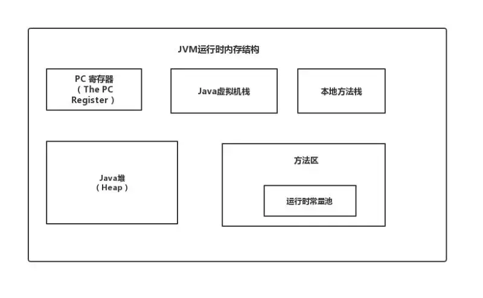

### 1.什么情况下会发生栈内存溢出
- 思路： 描述栈定义，再描述为什么会溢出，再说明一下相关配置参数，OK的话可以给面试官手写是一个栈溢出的demo。
- 栈定义：栈是线程私有，每个方法在执行的时候都会创建一个栈帧，用来存储局部变量表，操作数栈，动态链接，方法出口等信息。局部变量表又包含基本数据类型，对象引用类型
- 可能的原因：
  - 如果线程请求的栈深度大于虚拟机所允许的最大深度，将抛出StackOverflowError异常，如方法递归调用。
  - 如果Java虚拟机栈可以动态扩展，并且扩展的动作已经尝试过，但是无法申请到足够的内存去完成扩展，或者在新建立线程的时候没有足够的内存去创建对应的虚拟机栈，那么Java虚拟机将抛出一个OutOfMemory异常。(线程启动过多)
- 处理：参数 -Xss 去调整JVM栈的大小
### 2.详解JVM内存模型

### 3.JVM内存为什么要分成新生代，老年代，持久代。新生代中为什么要分为Eden和Survivor。
- 思路：先讲一下JAVA堆，新生代的划分，再谈谈它们之间的转化，相互之间一些参数的配置（如： –XX:NewRatio，–XX:SurvivorRatio等），再解释为什么要这样划分，最好加一点自己的理解。
  - 共享内存区划分
      - 持久带（方法区 + 其他） 
      - 堆 （ 老年代 + 新生代 <Eden + S0 + S1> ）
  - 一些参数的配置
    - –XX:NewRatio：新生代 ( Young ) 与老年代 ( Old ) 的比例的值为 1:2
    - –XX:SurvivorRatio：默认 Edem : from : to = 8 : 1 : 1 
    - -XX:+MaxTenuringThreshold：Survivor区中的对象被复制次数为15
  - 为什么要分为Eden和Survivor?
    - 如果没有Survivor，Eden区每进行一次Minor GC，存活的对象就会被送到老年代。老年代很快被填满，触发Major GC. 老年代的内存空间远大于新生代，进行一次Full GC消耗的时间比Minor GC长得多,所以需要分为Eden和Survivor。 
    - Survivor的存在意义，就是减少被送到老年代的对象，进而减少Full GC的发生，Survivor的预筛选保证，只有经历16次Minor GC还能在新生代中存活的对象，才会被送到老年代。
  - 为什么要设置两个Survivor区？
    - 设置两个Survivor区最大的好处就是解决了碎片化，刚刚新建的对象在Eden中，经历一次Minor GC，Eden中的存活对象就会被移动到第一块survivor space S0，Eden被清空；
    - 等Eden区再满了，就再触发一次Minor GC，Eden和S0中的存活对象又会被复制送入第二块survivor space S1 （这个过程非常重要，因为这种复制算法保证了S1中来自S0和Eden两部分的存活对象占用连续的内存空间，避免了碎片化的发生）
### 4.JVM中一次完整的GC流程是怎样的，对象如何晋升到老年代
- 思路： 先描述一下Java堆内存划分，再解释Minor GC，Major GC，full GC，描述它们之间转化流程。 
  - 当 Eden 区的空间满了，Java虚拟机会触发一次 Minor GC，以收集新生代的垃圾，存活下来的对象，则会转移到 Survivor区。 
  - 大对象（需要大量连续内存空间的Java对象，如那种很长的字符串）直接进入老年代； 
  - 如果对象在Eden出生，并经过第一次Minor GC后仍然存活，并且被Survivor容纳的话，年龄设为1，每熬过一次Minor GC，年龄+1，若年龄超过一定限制（15），则被晋升到老年态。即长期存活的对象进入老年态。 
  - 老年代满了而无法容纳更多的对象，Minor GC 之后通常就会进行Full GC，Full GC 清理整个内存堆 – 包括年轻代和年老代。 Major GC 发生在老年代的GC，清理老年区，经常会伴随至少一次Minor GC，比Minor GC慢10倍以上。

### 5.内存溢出和内存泄漏的区别？
- 内存溢出 
  - OutOfMemory，指程序在申请内存时，没有足够的内存空间供其使用。
- 内存泄露 
  - Memory Leak，指程序在申请内存后，无法释放已申请的内存空间，内存泄漏最终将导致内存溢出。

### 6.对象的内存布局了解吗？
- 对象在堆内存的存储布局可分为对象头、实例数据和对齐填充。
  - 对象头占 12B，包括对象标记和类型指针。对象标记存储对象自身的运行时数据，如哈希码、GC 分代年龄、锁标志、偏向线程 ID 等，这部分占 8B，称为 Mark Word。Mark Word 被设计为动态数据结构，以便在极小的空间存储更多数据，根据对象状态复用存储空间。
  - 类型指针是对象指向它的类型元数据的指针，占 4B。JVM 通过该指针来确定对象是哪个类的实例。
  - 实例数据是对象真正存储的有效信息，即本类对象的实例成员变量和所有可见的父类成员变量。存储顺序会受到虚拟机分配策略参数和字段在源码中定义顺序的影响。相同宽度的字段总是被分配到一起存放，在满足该前提条件的情况下父类中定义的变量会出现在子类之前。
  - 对齐填充不是必然存在的，仅起占位符作用。虚拟机的自动内存管理系统要求任何对象的大小必须是 8B 的倍数，对象头已被设为 8B 的 1 或 2 倍，如果对象实例数据部分没有对齐，需要对齐填充补全。